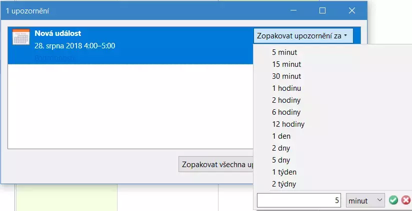

# More Snooze 

A Thunderbird and Lightning addon which allows to **customize the snooze times menu when snoozing calendar event alarms**.

Version 1.x is for Thunderbird up to version 67. Version 2.x is for Thunderbird 68 and newer.

