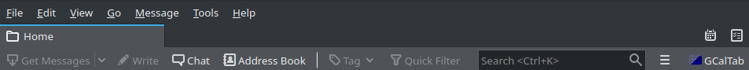

<p align="center"></p>

# GCalTab 
GCalTab is a Thunderbird add-on that opens Google Calendar website in a Thunderbird tab. It facilitates multiple accounts management.
and features a beautiful dark mode thanks to the [DarkReader](https://darkreader.org/) algorithm.  

******************
<p align="center">
    <strong>Get it from<br>
    <a href="https://addons.thunderbird.net/fr/thunderbird/addon/gcaltab">addons.thunderbird.net</a>
    </strong>
</p>

******************

## How does it work ?
Once the add-on is installed, a new icon appears in Thunderbird Mail toolbar:


Click on it to see GCalTab menu:  
<p align="center"></p>

Click on "Open" to open the Google Calendar tab:  
<p align="center"></p>

You can switch on/off the "Dark" button to activate DarkReader on the Google Calendar tab.

### There are plenty of add-ons that open a Google Calendar tab in Thunderbird. What does GCalTab bring ?
GCalTab brings two things that are often missed in other add-ons:  
* The possibility to switch to a dark mode. Save your eyes !
* The possibility to simply disconnect - reconnect and switch between several accounts from GCalTab menu.  

### What permissions are needed ?
GCalTab will need to access your data for:  
* accounts.google.com  
* calendar.google.com  
* google.com  

In addition, GCalTab will need to access Thunderbird tabs to maintain a unique tab.

### Does it means that GCalTab collects my data ?
No, GCalTab simply opens tabs in Thunderbird, exactly as it would be done in a web browser.  
It does not collect any data.  
These permissions are needed to allow GCalTab to "manage" tabs for these three domains in Thunderbird. "Manage" means:
* opening tabs
* execute scripts on these tabs

Tabs are open for obvious reason: that's the aim of the add-on.  
The only script that can be executed on these tabs is the [DarkReader](https://darkreader.org/) algorithm, that has a strict [privacy policy](https://darkreader.org/privacy/).  

Of course, Google Calendar works as it would do in your web browser, including regarding data collection.  

### So GCalTab will never collect my data ?
Never.

### How do I stay connected when I re-open Thunderbird ?
If you wish to stay connected to Google Calendar, you will have to allow cookies.  
The cookies menu can be access as follow in Thunderbird:    
_GNU/Linux_ : "Edit" > "Preferences" > "Privacy" or "Privacy and Security" > "Web Content" section.  
_macOS_ : "Thunderbird" > "Preferences" > "Privacy" or "Privacy and Security" > "Web Content" section.  
_Windows_ : "Tools" > "Options" > "Privacy" or "Privacy and Security" > "Web Content" section.  
You will have to allow and keep cookies for these three domains:
* accounts.google.com
* calendar.google.com
* google.com

### How do I disconnect from a Google Calendar account ?
If you use the Google Calendar "Sign out" button, the link will open in your web browser and will not disconnect Thunderbird but your web browser session.  
**Since version 0.5**, it is possible to sign out from GCalTab menu by pushing the "Sign out" button .  

### How do I switch to another Google Calendar account ? 
If you use the Google Calendar "Add account" or "Manage your Google Account" button, the link will open in your web browser and will not change your Thunderbird session.  
**Since version 0.7**  
If you have ever connected to the account you wish to switch to, you can click the "Switch account" button .  
If you wish to connect to a new account, this can be done by clicking the "Add account" button .  

## Build from source
Prerequisite:  
Install [web-ext](https://extensionworkshop.com/documentation/develop/getting-started-with-web-ext/).  

The add-on can be built by running the following command from its root directory:  
```
web-ext build
```

More specifically, if you have cloned this repository, you can run:
```
web-ext build --ignore-files=images README.md
```

## Legal notice
Thunderbird is a registered trademark of the Mozilla Foundation.  
Google is a registered trademark of Google LLC.  
GNU is a registered trademark of the Free Software Foundation.  
Linux is a registered trademark of Linus Torvalds.  
Windows is a registered trademark of Microsoft Corporation.  
macOS is a registered trademark of Apple Inc.  

The above-mentioned trademarks are only used to refer to products.  
GCalTab and its developer are not affiliated, sponsored nor endorsed by any of the above-mentioned organizations.  

## Acknowledgments
GCalTab is styled with [Spectre.css](https://picturepan2.github.io/spectre/)  
GCalTab uses Font Awesome icons available under [Creative Commons Attribution 4.0 International license](https://fontawesome.com/license)

## Changelog
1.0.0 -> npm is now used to manage 3rd party libraries, upgrade to DarkReader v4.9.16 and Spectre.css v0.5.9
0.7 -> addition of buttons to ease multiple accounts management  
0.6 -> upgrade to DarkReader v4.9.10  
0.5 -> addition of the disconnexion button  
0.4 -> first release  
